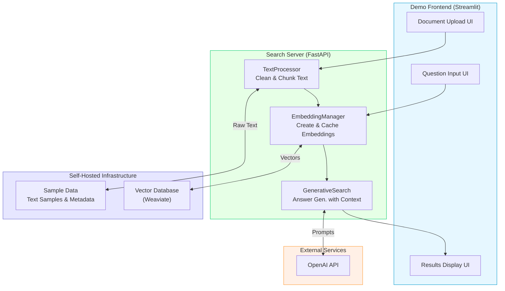

# Semantic Search with Generative AI

A production-ready semantic search application that combines vector embeddings and Large Language Models to provide intelligent question answering and information retrieval over custom document collections. The system features a self-hosted Weaviate vector database for complete control over your data, without relying on external vector database services.

## 📋 Table of Contents

- [Architecture Overview](#architecture-overview)
- [Project Highlights](#project-highlights)
- [Features](#features)
- [Key Components](#key-components)
- [Getting Started](#getting-started)
- [API Usage](#api-usage)
- [Deployment Options](#deployment-options)
  - [Docker Deployment](#docker-deployment-recommended)
  - [Kubernetes Deployment](#kubernetes-deployment)
  - [Cloud Infrastructure with Terraform](#terraform-infrastructure)
- [CI/CD Pipeline](#cicd-pipeline)
- [Development Guide](#development-guide)
- [Troubleshooting](#troubleshooting)
- [Project Structure](#project-structure)

## 🏗️ Architecture Overview



> **IMPORTANT:** Unlike many other RAG solutions that rely on cloud-based vector databases, this system includes a **self-hosted Weaviate vector database** deployed alongside the application components. This architectural choice provides full control over your data, eliminates external dependencies, and enhances privacy and security.

### Core Components and Data Flow

1. **Search Server (FastAPI)**

   - **TextProcessor**: Document preprocessing and chunking
   - **EmbeddingManager**: Vector operations and caching
   - **GenerativeSearch**: Search and answer generation

2. **Self-Hosted Vector Database (Weaviate)**

   - Containerized vector database deployed with the application
   - Full control over vector data storage and configuration
   - No external cloud vector database dependencies
   - Scalable vector storage and search
   - Document metadata management
   - Real-time similarity search

3. **OpenAI Integration**

   - Embedding Generation (text-embedding-3-small)
   - Text Generation (GPT-3.5 Turbo)
   - Configurable parameters

4. **Data Pipelines**

   ```
   Document Processing:
   Raw Text → TextProcessor → Chunks → EmbeddingManager → Vectors → Weaviate

   Question Answering:
   Question → EmbeddingManager → Similar Chunks → GenerativeSearch → Answer

   Sample Data:
   Sample Data → TextProcessor → EmbeddingGenerator → Cached Vectors → Weaviate
   ```

## ✨ Features

### Core Capabilities

- **Advanced Semantic Search**

  - Meaning-based content discovery
  - Multi-document context awareness
  - Configurable search parameters

- **Intelligent Document Processing**

  - Automatic text chunking
  - Semantic relationship preservation
  - Multiple document format support

- **AI-Powered Question Answering**
  - Context-aware responses
  - Multiple generation options
  - Confidence scoring

### Technical Features

- **Production-Ready Architecture**

  - Fault tolerance and fallbacks
  - Efficient caching system
  - Comprehensive monitoring
  - Secure key management

- **Developer-Friendly API**

  - RESTful endpoints
  - Comprehensive documentation
  - Example implementations

- **Robust Data Management**
  - Vector database optimization
  - Efficient data indexing
  - Backup and recovery options

## 🚀 Getting Started

### Prerequisites

- Python 3.9+
- Docker and Docker Compose
- OpenAI API key
- (Optional) Kubernetes cluster for k8s deployment
- (Optional) GCP account for Terraform deployment

### Quick Start

1. **Clone the repository**

   ```bash
   git clone https://github.com/tuandung12092002/semantic-search.git
   cd semantic-search
   ```

2. **Set up environment**

   ```bash
   # Create environment files
   cp .env.example .env
   echo "your_openai_api_key" > openai_api_key.txt
   echo "your_weaviate_api_key" > weaviate_api_key.txt
   ```

3. **Start the application**

   ```bash
   docker-compose -f docker/docker-compose.full.yml up -d
   ```

4. **Access the services**
   - Demo UI: http://localhost:8501
   - API Docs: http://localhost:8000/docs
   - Weaviate Console: http://localhost:8082/v1/console

## 🔧 API Usage

### Process Documents

```bash
curl -X POST http://localhost:8000/process-text \
  -H "Content-Type: application/json" \
  -d '{
    "text": "Your document content here",
    "metadata": {
      "source": "example.pdf",
      "author": "John Doe"
    }
  }'
```

### Ask Questions

   ```bash
curl -X POST http://localhost:8000/ask-question \
  -H "Content-Type: application/json" \
  -d '{
    "question": "What is semantic search?",
    "num_search_results": 3,
    "num_generations": 1,
    "temperature": 0.7
  }'
```

### Search Documents

```bash
curl -X POST http://localhost:8000/search \
  -H "Content-Type: application/json" \
  -d '{
    "query": "quantum computing applications",
    "limit": 5
  }'
```

## 🔄 CI/CD Pipeline

### Workflow Overview

- **Automated Testing**: Unit and integration tests
- **Docker Image Building**: Multi-stage builds with caching
- **Deployment**: Automated deployment to staging/production
- **Security Scans**: Dependency and container scanning

### Configuration

1. **Required Secrets**

   - `DOCKERHUB_TOKEN`: Docker Hub access token
   - `OPENAI_API_KEY`: OpenAI API key
   - `WEAVIATE_API_KEY`: Weaviate API key

2. **Workflow Triggers**
   - Push to main/master
   - Pull requests
   - Manual dispatch

## 🛠️ Development Guide

### Local Development

1. **Set up virtual environment**

   ```bash
   python -m venv venv
   source venv/bin/activate  # or `venv\Scripts\activate` on Windows
   pip install -r requirements.txt
   ```

2. **Install development dependencies**

   ```bash
   pip install -r requirements-dev.txt
   ```

3. **Run tests**
   ```bash
   pytest tests/
   ```

### Code Style

- Follow PEP 8 guidelines
- Use type hints
- Write docstrings for all functions
- Maintain test coverage

## ❗ Troubleshooting

### Common Issues and Solutions

1. **OpenAI API Issues**

   - **Error**: Authentication failed
     ```
     Solution: Check API key in .env and secrets
     ```
   - **Error**: Rate limit exceeded
     ```
     Solution: Implement request throttling or upgrade API tier
     ```

2. **Docker Issues**

   - **Error**: Container fails to start
     ```
     Solution: Check logs with `docker-compose logs`
     ```
   - **Error**: Memory limits
     ```
     Solution: Adjust Docker resource allocation
     ```

3. **Vector Database Issues**
   - **Error**: Connection timeout
     ```
     Solution: Verify Weaviate container health
     ```
   - **Error**: Index corruption
     ```
     Solution: Rebuild index with provided script
     ```

## 📚 Additional Resources

- [API Documentation](https://github.com/tuandung12092002/semantic-search/wiki/API-Documentation)
- [Development Guide](https://github.com/tuandung12092002/semantic-search/wiki/Development-Guide)
- [Deployment Guide](https://github.com/tuandung12092002/semantic-search/wiki/Deployment-Guide)
- [Contributing Guidelines](https://github.com/tuandung12092002/semantic-search/blob/main/CONTRIBUTING.md)
- [Change Log](https://github.com/tuandung12092002/semantic-search/blob/main/CHANGELOG.md)

## 📄 License

This project is licensed under the MIT License - see the [LICENSE](LICENSE) file for details.

## 🙏 Acknowledgments

- OpenAI team for their excellent API and models
- Weaviate team for the vector database
- FastAPI and Streamlit teams for their frameworks
- The open-source community for their contributions

## 📁 Project Structure

```
semantic-search/
├── .github/                      # GitHub configuration 
│   └── workflows/                # GitHub Actions CI/CD workflows
│       ├── docker-build-push.yml # Workflow for building and pushing Docker images
│       ├── lint-and-test.yml     # Workflow for code linting and testing
│       └── test-deployment.yml   # Workflow for testing the deployment
│
├── docker/                       # Docker configuration
│   ├── demo_app.Dockerfile       # Dockerfile for Streamlit demo frontend
│   ├── search_server.Dockerfile  # Dockerfile for FastAPI search server
│   └── docker-compose.full.yml   # Docker Compose configuration for all services
│
├── src/                          # Source code
│   ├── demo_app/                 # Streamlit frontend application
│   │   └── app.py                # Main Streamlit app entry point
│   │
│   ├── search_server/            # FastAPI server application
│   │   ├── api/                  # API endpoints definitions
│   │   └── main.py               # FastAPI server entry point
│   │
│   └── semantic_search/          # Core semantic search functionality
│       ├── config.py             # Configuration and settings
│       ├── embedding_manager.py  # Vector embeddings generation and management
│       ├── generative_search.py  # Combines search with LLM generation
│       ├── sample_data.py        # Example data for demonstration
│       ├── search_interface.py   # Main interface for search operations
│       └── text_processor.py     # Text chunking and preprocessing
│
├── tests/                        # Test suite
│   ├── unit/                     # Unit tests for individual components
│   └── integration/              # Integration tests across components
│
├── .env.example                  # Example environment variables
├── CONTRIBUTING.md               # Contribution guidelines
├── DEVELOPMENT.md                # Development setup and guidelines
├── README.md                     # Project documentation
├── requirements.txt              # Python dependencies
└── setup.py                      # Package installation script
```

### Key Components

#### 1. Docker Configuration
- **demo_app.Dockerfile**: Containerizes the Streamlit frontend
- **search_server.Dockerfile**: Containerizes the FastAPI backend
- **docker-compose.full.yml**: Orchestrates all services (Weaviate, Search Server, Demo App)

#### 2. Source Code
- **demo_app**: Interactive Streamlit frontend for document uploading and question answering
- **search_server**: FastAPI backend exposing REST endpoints for semantic search operations
- **semantic_search**: Core library implementing vector search and LLM integration

#### 3. CI/CD Pipeline
- **docker-build-push.yml**: Builds and publishes Docker images
- **lint-and-test.yml**: Verifies code quality and runs automated tests
- **test-deployment.yml**: Validates deployment functionality

#### 4. Documentation
- **README.md**: Main project documentation
- **DEVELOPMENT.md**: Guide for developers
- **CONTRIBUTING.md**: Guidelines for contributors

### Service Architecture

The project consists of three main services, all running in Docker containers:

1. **Self-Hosted Weaviate Vector Database**: 
   - Deployed as a containerized service alongside your application
   - Stores document embeddings and enables similarity search
   - Provides complete control over your vector data
   - Eliminates dependency on external vector database services
   - Configured for optimal performance with your specific data needs

2. **Search Server (FastAPI)**: 
   - Processes documents, generates embeddings, and serves search requests
   - Communicates directly with the self-hosted Weaviate instance
   - Handles all vector operations without external dependencies

3. **Demo Frontend (Streamlit)**: 
   - Provides a user-friendly interface for interacting with the system
   - Connects to the Search Server API for document processing and querying

## 🌟 Project Highlights

- **Designed and implemented a full-stack RAG system** using FastAPI, Weaviate, and OpenAI
- **Architected a containerized microservices solution** with Docker Compose for local development
- **Deployed a fully self-hosted vector database** for complete data control and privacy
- **Implemented CI/CD pipelines with GitHub Actions** for automated testing, building, and deployment
- **Created Kubernetes manifests for production deployment** with scalability and high availability
- **Configured Terraform IaC** for reproducible cloud infrastructure provisioning
- **Set up automated Docker image publishing** to Docker Hub registry with versioning
- **Engineered an intelligent text processing pipeline** for optimal document chunking
- **Developed comprehensive REST API endpoints** with OpenAPI documentation
- **Implemented secure secrets management** across local and cloud environments
- **Optimized vector search performance** through database configuration and query tuning
- **Created resilient error handling mechanisms** with fallbacks for all external dependencies
